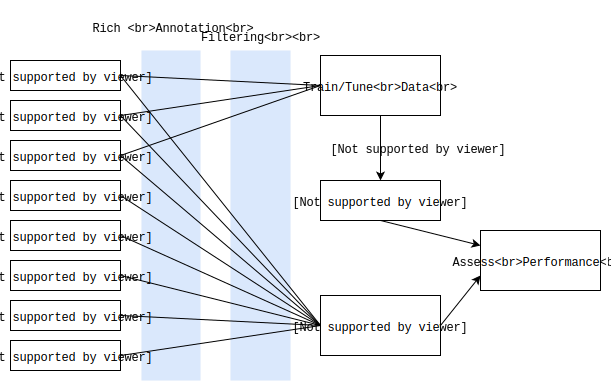

## Abstract
  Identification of pathogenic variant(s) from human exome or genome sequencing (WGS) is a crucial and difficult task. With the dramatic reduction in sequencing costs, it is an increasingly common task. Even after filtering for rare coding and splicing variants, numerous prioritized variants remain for most patients. Current prioritization strategies use a combination of in silico predictions and knowledge of likely deleterious genes for the condition, along with large variety of scoring metrics. Popular metrics include conservation and predicted functionality-based scores like GERP, SIFT, GERP, CADD, and REVEL. To better guide variant analysis, we use a novel and broad dataset of rare and richly annotated variants to train a mendelian disease DNA variant pathogenicity model. We curated a machine learning input dataset including a high quality ClinVar pathogenic/benign dataset, 425 solved retinal degeneration WGS cases, and rare variants from gnomAD. The hundreds of thousands of variants were richly annotated with hundreds of variant metrics including constrained coding regions (ccr), ENCODE epigenetic data, GTEx gene expression data, and other pathogenicity metrics (e.g. REVEL, FATHMM, MetaSVM). The advantage of this strategy is the use of a broad, curated set of rare benign variants and a richer set of annotations. Our dataset, when used with a random forest and xgboost models to predict DNA variant pathogenicity, highlights ccr, the ExAC missense and loss of function Z-scores, PhyloP, CADD, and gnomAD population metrics as the most crucial scores. We then trained a deep LSTM neural network model and merged it with the random forest and xgboost models to create an ensemble learner, Distill, with class leading pathogenicity prediction across a diverse set of test sets.

## Introduction

### Assessment of mendelian pathogenic variant involves distilling dozens of potential variants

### Many ensemble algorithms built and assessed with unrealistic datasets

Balanced number of pathogenic and non-pathogenic variants

Non-pathogenic variants selected from alleles with high population allele frequencies

## Results

### Three different data sources used to build training data

### DNA variants labeled with over one hundred annotations

### Only rare variants used for training and testing

### 250 to 1 ratio of non pathogenic to pathogenic variants used to build training set

### Three different machine learning algorithms built and combined to create Distill

### Diverse set of labeled diseaese causing DNA variation sources used to validate Distill

### In unbalanced situations, Distill provides more useful scoring than other ensembl metrics

### Distill provides slightly better performance in other curated datasets

### Discovery of novel disease causing variants with Distill

## Discussion

## Methods and Materials

## References
